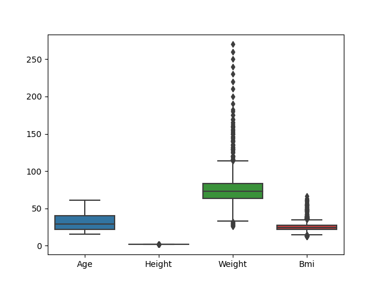
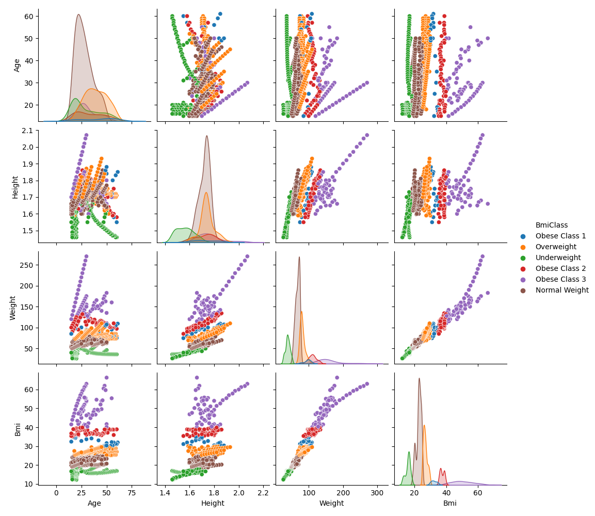

# IDS706-Week2-project

 

This is a week-2 assigment project for IDS706 by Anastasiia Saenko (as1466 Duke NetId).
This project is build on week-1 template and includes basic files such as: 

* Devcontainer with DockerFile
* workflows with github actions
* gitingnore file
* this Readme.md file
* requirements.txt file
* main.py
* [Statistics_report.md](https://github.com/nogibjj/as1466_week2_DE/blob/main/Statistics_report.md) - summary report with data visualizations and summary statistics for the dataframe
* [bmi.csv](https://github.com/nogibjj/as1466_week2_DE/blob/main/bmi.csv) - dataframe used in the python script 

# Additional files and actions for the week-2 assignment: 

* main.py file consists of basic summary statistics functions based on Pandas library. The script also downloads the main bmi.csv file and creates an auto-generated Statistics_report.md report with overall variables statistics and two Exploratory Data Plots (boxplots.png and pairplot.png). The script writes and saves three files: two png plot files and md file that is used for auto-generated report for the DataFrame. 
* test_main.py runs tests on the basic functions in the main.py file
* Python CI ymal file in github/workflows has two additional actions that run within this projects - first one adds three newly generated files to the repository and the second one uses Statistics_report.md file to append to the current README.md file to have updated summary report right here in the readme file. You can find this report below. 

# This is the generated report for summary statistics and data visualization for [bmi.csv](https://github.com/nogibjj/as1466_week2_DE/blob/main/bmi.csv) file

## Overall dataset descriptive statistics

|       |      Age |      Height |   Weight |       Bmi |
|:------|---------:|------------:|---------:|----------:|
| count | 741      | 741         | 741      | 741       |
| mean  |  31.6181 |   1.70943   |  78.4125 |  26.3654  |
| std   |  11.6555 |   0.0859744 |  32.2545 |   9.22319 |
| min   |  15      |   1.46      |  25.9    |  12.1505  |
| 25%   |  22      |   1.67      |  63      |  22.1297  |
| 50%   |  29      |   1.721     |  72.9    |  24.1324  |
| 75%   |  40      |   1.751     |  83.3    |  27.2493  |
| max   |  61      |   2.07      | 270      |  66.3013  |

## Here are some data visualizations of data to understand relationships between variables

### Boxplots of each variable

### Pairplots of correlation between numerical variables, segmented by BMI segment

